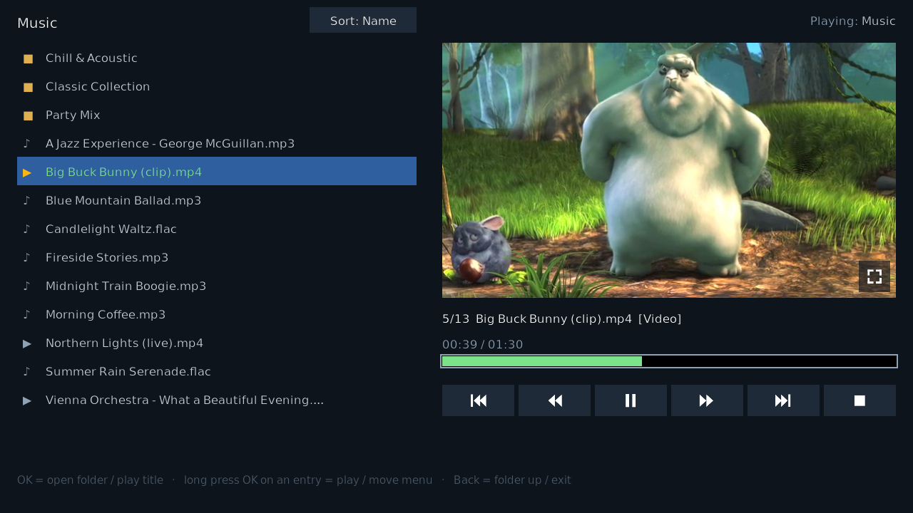
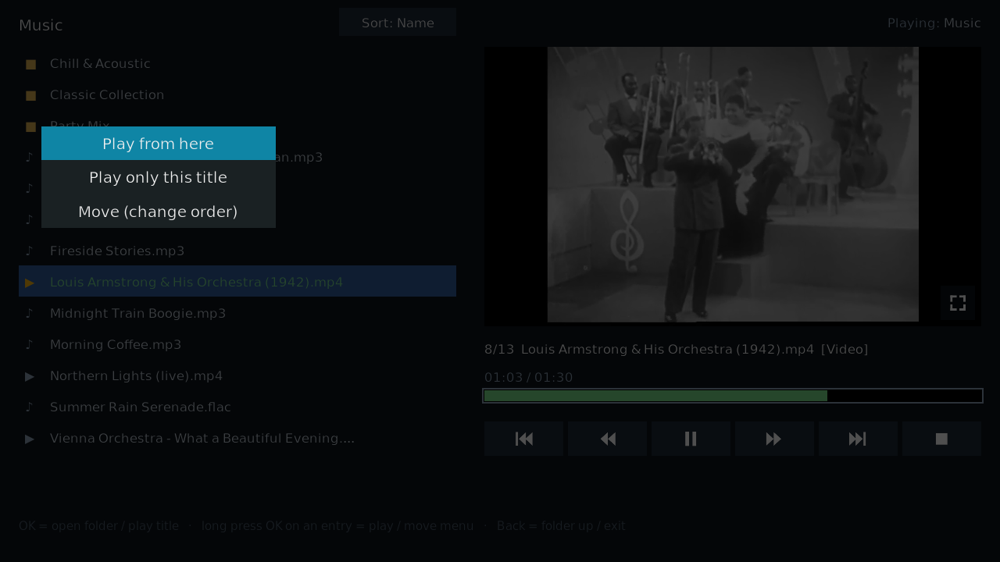
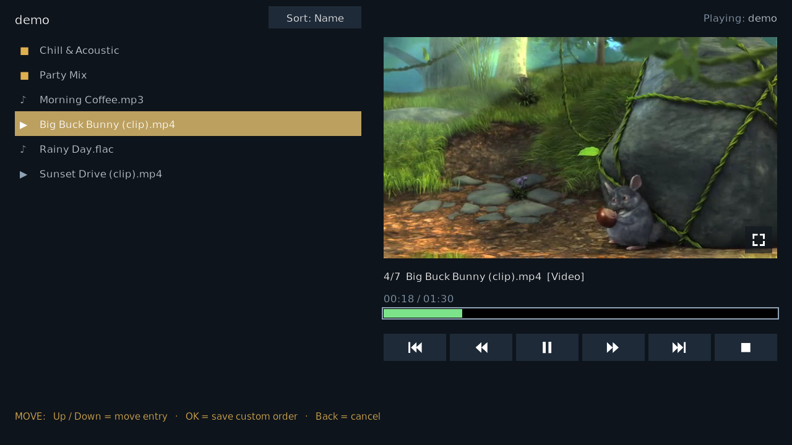
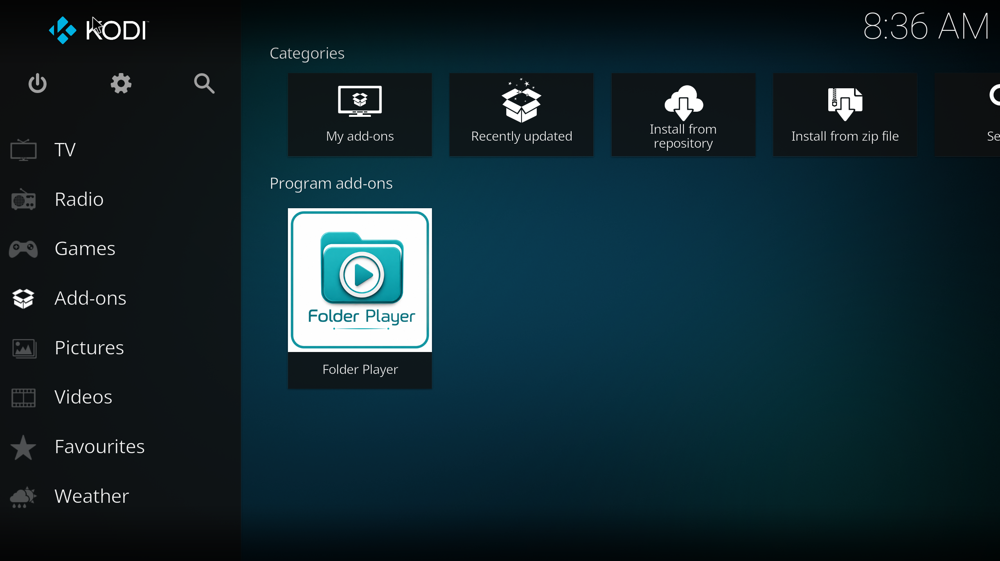

# Folder Player — Kodi add-on

Play a folder of **mixed audio-files and video files** as one playlist.
No library, no scanning, no thumbnails: a plain folder view.

Built for TV remotes (Android/Google TV); mouse and touch work too. Tested on Kodi 21 (Linux,
Windows) and Kodi 22 beta (Android TV). Landscape only — like Kodi itself.

Video in the screenshots: Louis Armstrong &amp; His Orchestra, 1942 "Soundie" short film (public domain, via the Prelinger Archives)

## Features

- Left: the current folder, subfolders, audio ♪, and video ▶ files.
  Right: video of the running title (empty for audio), time, seekable progress bar, navigation/transport icons
- Optional fullscreen mode for videos
- Per-folder/playlist sort by:  Name / Date / Shuffle / Custom. Shuffle randomizes the whole tree for
  playback. Custom order: move entries by hand — auto-saved per folder
- Plays from network shares (SMB, NFS, …) as well as local storage — any folder source Kodi can browse
- Browse while playing: the header shows what folder is playing, the list highlights the running
  title (or the subfolder containing it)

## Install

1. Kodi → Settings → System → Add-ons → **Unknown sources** on
2. Add-ons → **Install from zip file** → pick the zip from the
   [latest release](https://github.com/Cosmopolyte/kodi-folderplayer/releases/latest)
3. Add-ons → Program add-ons → **Folder Player** — on first start it asks for your music folder

 Program add-ons > Folder Player"/>

Updating: install the newer zip over the old one; settings and custom orders are kept.

Settings: start folder, default sort order, max titles per queue (raise it to play very large
folder trees in one go — building the queue takes longer then), optional log-file folder.

## Controls

| Input | Action |
|---|---|
| OK on a folder | open it |
| OK on a title | play the list from there |
| Long-press OK on an entry | menu: **Play from here** · **Play only this folder/title** · **Move** |
| Long-press OK elsewhere | cycle sort mode |
| Back | folder up; in the start folder: exit |
| Play/pause media key | pause/resume; when idle: play the highlighted folder/title |
| Skip keys | previous / next title |
| Progress bar | focus it: Left/Right seek 10 s, OK = pause; mouse/touch: click to seek |
| Move mode | Up/Down move the entry, OK saves the custom order, Back cancels |

## About

Developed with AI assistance (Anthropic's Claude, driven and reviewed by a human), released in the
hope it is useful. MIT license, no warranty. Issues and PRs welcome — hobby project, response times
vary.

Developer notes — building the zip, the Docker test environment, skin layout ids, and the collected
Kodi pitfalls: [docs/DEVELOPMENT.md](docs/DEVELOPMENT.md). Version history: see the
[releases](https://github.com/Cosmopolyte/kodi-folderplayer/releases).
